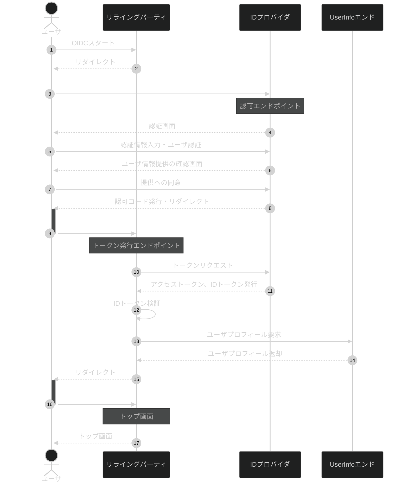

# Nob OpenID Connect 設計書

標準的な OpenID Connect に従った認証機能をフルスクラッチで実装する用の設計書です。`response_type=code`であり、 `scope`に`openid`を含む場合

## 業務フロー

業務シーケンスの概要です。

## 参考文献

- [OpenID Connect について勉強したのでまとめる](https://zenn.dev/bonvoyage/articles/5dda6a1effd022)
- [30 分で OpenID Connect 完全に理解したと言えるようになる勉強会](https://speakerdeck.com/d_endo/30fen-deopenid-connectwan-quan-nili-jie-sitatoyan-eruyouninarumian-qiang-hui?slide=65)
- [図解 OpenID Connect による ID 連携](https://qiita.com/TakahikoKawasaki/items/701e093b527d826fd62c)
- [OpenID Connect 全フロー解説](https://qiita.com/TakahikoKawasaki/items/4ee9b55db9f7ef352b47#1-response_typecode)
