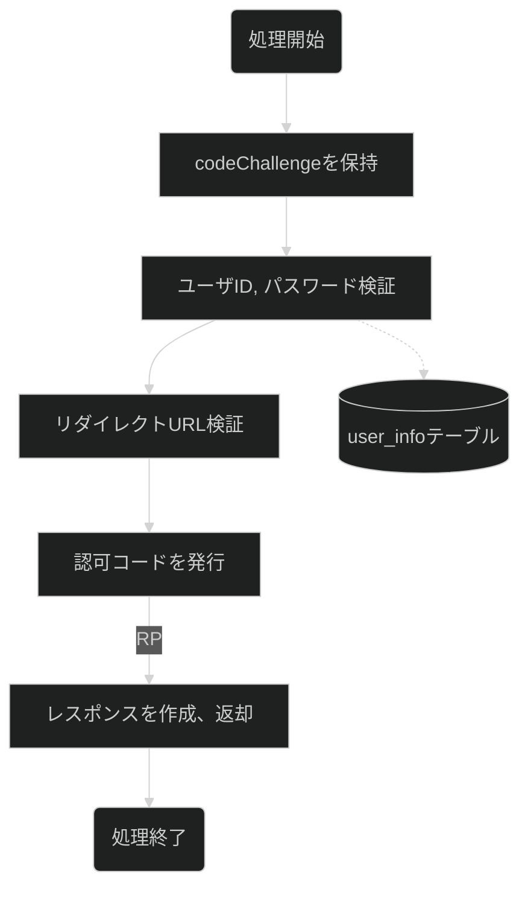

# 認証 API

```mermaid
%%{init:{'theme':'dark'}}%%
graph TD;
    A(処理開始) --> B[codeChallengeを保持]
    B --> C[ユーザID, パスワード検証]
    C --> D[リダイレクトURL検証]
    C -.-> E[(user_infoテーブル)]
    D --> F[認可コードを発行]
    F --> |RP| G[レスポンスを作成、返却]
    G --> H(処理終了)
```
