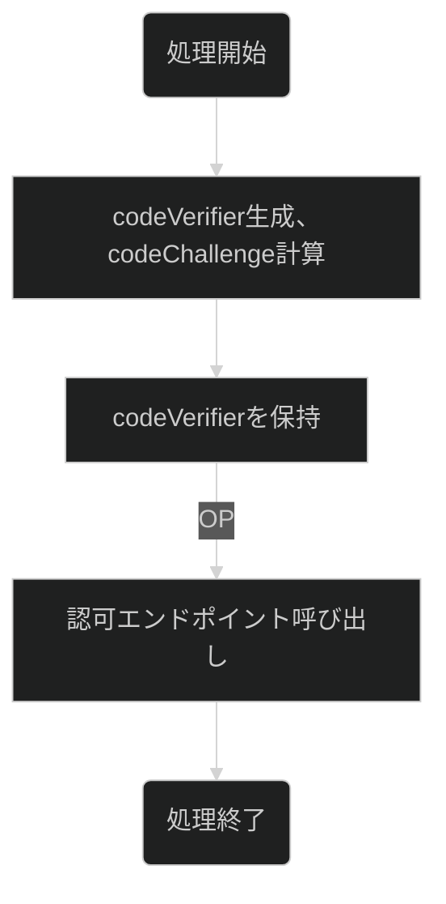

# 認可エンドポイントリダイレクト API

```mermaid
%%{init:{'theme':'dark'}}%%
graph TD;
    A(処理開始) --> B[codeVerifier生成、codeChallenge計算]
    B --> C[codeVerifierを保持]
    C --> |OP| D[認可エンドポイント呼び出し]
    D --> E(処理終了)
```
