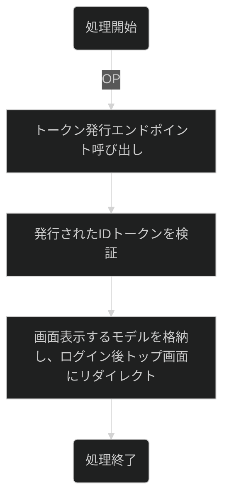

# アクセストークン取得 API

```mermaid
%%{init:{'theme':'dark'}}%%
graph TD;
    A(処理開始) --> |OP| B[トークン発行エンドポイント呼び出し]
    B --> C[発行されたIDトークンを検証]
    C --> D[画面表示するモデルを格納し、ログイン後トップ画面にリダイレクト]
    D --> E(処理終了)
```
