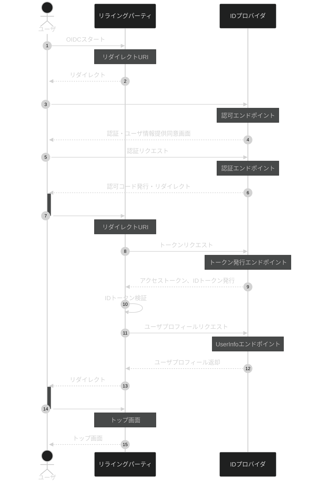

# 業務シーケンス

業務の流れをまとめた仕様書です。

## シーケンス図

業務シーケンスの概要です。

## 参考文献

- [OpenID Connect について勉強したのでまとめる](https://zenn.dev/bonvoyage/articles/5dda6a1effd022)
- [30 分で OpenID Connect 完全に理解したと言えるようになる勉強会](https://speakerdeck.com/d_endo/30fen-deopenid-connectwan-quan-nili-jie-sitatoyan-eruyouninarumian-qiang-hui?slide=65)
- [図解 OpenID Connect による ID 連携](https://qiita.com/TakahikoKawasaki/items/701e093b527d826fd62c)
- [OpenID Connect 全フロー解説](https://qiita.com/TakahikoKawasaki/items/4ee9b55db9f7ef352b47#1-response_typecode)
- [OpenID Connect 概要](https://www.slideshare.net/oidfj/openid-connect-intro-september-2013)
- [OpenID Connect の定義をわかりやすく解説](https://qiita.com/rendaman0215/items/94ade32a5e38c47ec5b4)
- [OAuth 2.0 認可コードフロー](https://qiita.com/TakahikoKawasaki/items/200951e5b5929f840a1f#1-%E8%AA%8D%E5%8F%AF%E3%82%B3%E3%83%BC%E3%83%89%E3%83%95%E3%83%AD%E3%83%BC)
