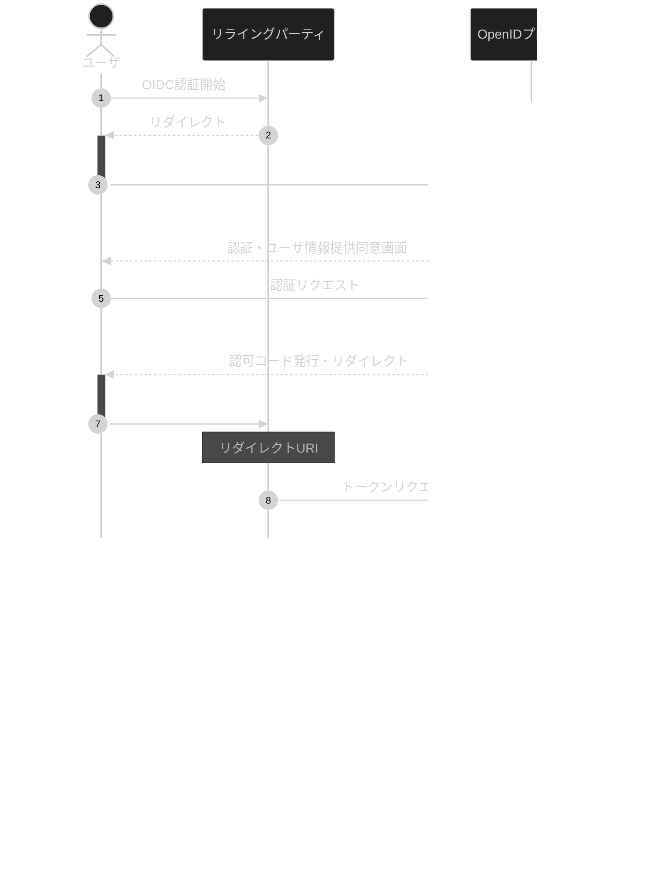

# 業務シーケンス

```mermaid
%%{init:{'theme':'dark'}}%%
sequenceDiagram
autonumber
    actor user as ユーザ
    participant relying_party as リライングパーティ
    participant oid_provider as OpenIDプロバイダ

    user->>relying_party: OIDC認証開始
    relying_party-->>+user: リダイレクト
    user->>-oid_provider: <br>
    Note over oid_provider: 認可エンドポイント
    oid_provider-->>user: 認証・ユーザ情報提供同意画面
    user->>oid_provider: 認証リクエスト
    Note over oid_provider: 認証エンドポイント
    oid_provider-->>+user: 認可コード発行・リダイレクト
    user->>-relying_party: <br>
    Note over relying_party: リダイレクトURI
    relying_party->>oid_provider: トークンリクエスト
    Note over oid_provider: トークン発行エンドポイント
    oid_provider-->>relying_party: アクセストークン、IDトークン発行
    relying_party->>relying_party: IDトークン検証
    relying_party-->>+user: リダイレクト
    user->>-relying_party: <br>
    Note over relying_party: トップ画面
    relying_party-->>user: トップ画面
```
