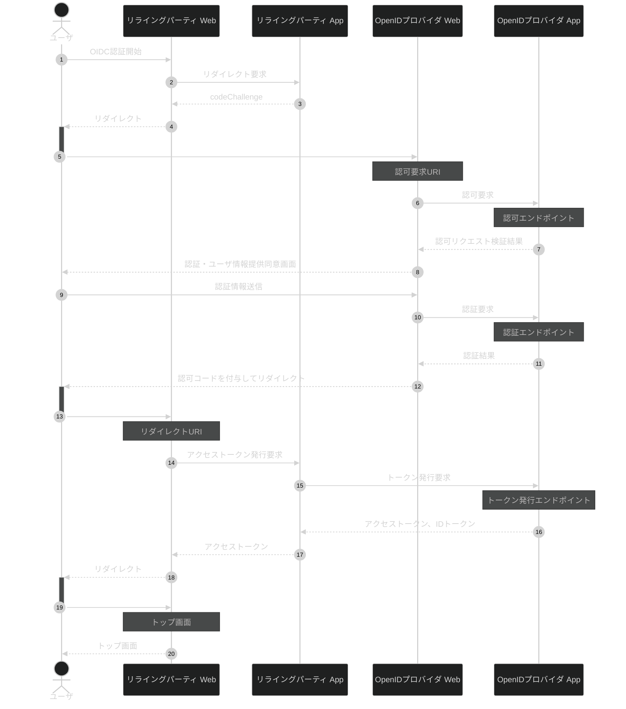

# 業務シーケンス

```mermaid
%%{init:{'theme':'dark'}}%%
sequenceDiagram
autonumber
    actor user as ユーザ
    participant rp_web as リライングパーティ Web
    participant rp_app as リライングパーティ App
    participant op_web as OpenIDプロバイダ Web
    participant op_app as OpenIDプロバイダ App

    user->>rp_web: OIDC認証開始
    rp_web->>rp_app: リダイレクト要求
    rp_app-->>rp_web: codeChallenge
    rp_web-->>+user: リダイレクト
    user->>-op_web: <br>
    Note over op_web: 認可要求URI
    op_web->>op_app: 認可要求
    Note over op_app: 認可エンドポイント
    op_app-->>op_web: 認可リクエスト検証結果
    op_web-->>user: 認証・ユーザ情報提供同意画面
    user->>op_web: 認証情報送信
    op_web->>op_app: 認証要求
    Note over op_app: 認証エンドポイント
    op_app-->>op_web: 認証結果
    op_web-->>+user: 認可コードを付与してリダイレクト
    user->>-rp_web: <br>
    Note over rp_web: リダイレクトURI
    rp_web->>rp_app: アクセストークン発行要求
    rp_app->>op_app: トークン発行要求
    Note over op_app: トークン発行エンドポイント
    op_app-->>rp_app: アクセストークン、IDトークン
    rp_app-->>rp_web: アクセストークン
    rp_web-->>+user: リダイレクト
    user->>-rp_web: <br>
    Note over rp_web: トップ画面
    rp_web-->>user: トップ画面
```
