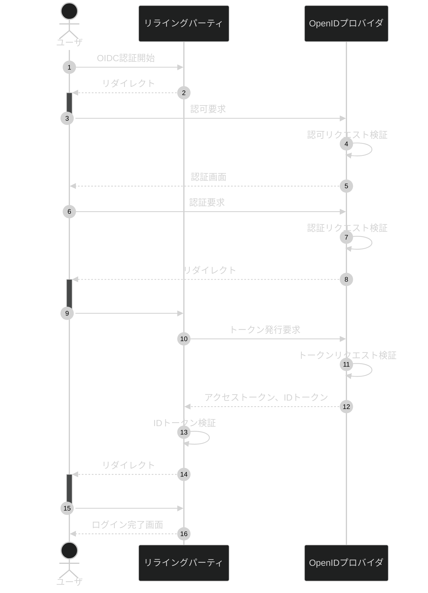

# はじめての OpenId Connect

**OpenID Connect** のうち、**認可コードフロー**と呼ばれる認証方式でのログイン認証フローについて解説します。

## 登場人物

### リライングパーティ（RP）

業務サービスの提供を担当します。認可・認証を後述の OpenID プロバイダに一任しているため、リライングパーティのサーバ内にはユーザ個人を特定できる情報を持たずに済みます。

### OpenID プロバイダ（OP）

認証を担当します。OpenID プロバイダが発行したアクセストークンを使うことでユーザがリライングパーティのサービスを利用することができるようになります。

## 認証フロー

認証開始から終了までのフローです。

## 各種処理詳細

WIP
